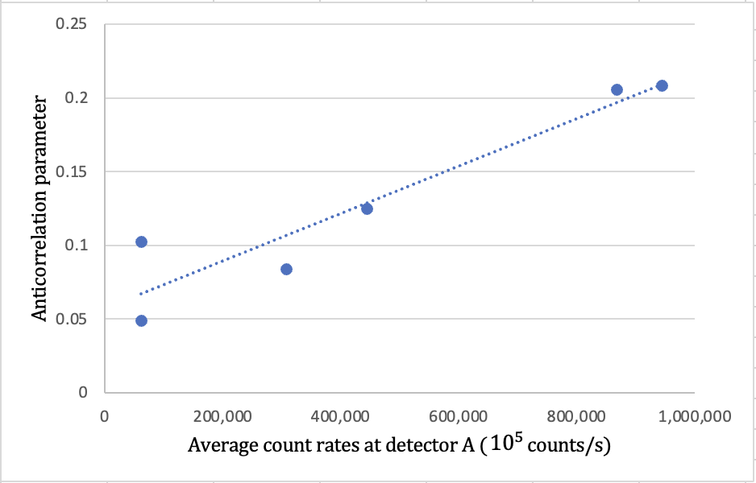

::: {.callout-note appearance="simple"}
**Affiliation:** Physics Department, Lawrence University, Appleton, Wisconsin 54911.
:::

## Abstract

We conducted two undergraduate-level single-photon optics experiments that demonstrated quantum mechanical behaviors of light. In our paper, we reproduced the experiments presented in the original Grangier et al. paper but replaced their atomic cascade with a spontaneous parametric downconversion light source that also used a gating detection scheme but with higher production rates. Our results gave us an anti-correlation parameter for 3 detectors as low as $\alpha_{3d} = 0.0488 \pm 0.005$, which deviated significantly from the classical prediction that $\alpha_{3d} >1$. The second experiment was carried out with the Mach Zehnder interferometer where we saw the probabilistic behavior of quantum mechanics. As light took two identical paths along the interferometer arms, single photons displayed patterns of interference as a function of the path length difference of the arms. We explored path distinguishability both in terms of path polarization and path length difference. The latter depended on a parameter known as coherence length. We observed fringes with visibility up to $V = 0.430 \pm 0.024$, compared to Grangier et al.'s 0.98 visibility.

------------------------------------------------------------------------

## Introduction

Albert Einstein, in his 1905 papers on the photoelectric effect, was the first to suggest that the electromagnetic field, or light, is composed of quanta known as photons. The idea was not well received until results from the Compton scattering experiment in 1923 aligned with Einstein's papers and further convinced physicists of the existence of photons.

Although non-classical effects in the statistical properties of light were studied by many, it was not until 1986 when Grangier, Roger, and Aspect published the first experiments that dealt with single-photon state of light impinging on a beamsplitter. They used atomic cascade as a light source and a triggered detection scheme to verify the single-photon state of light. Using the result, they extended the setup into a Mach-Zehnder interferometer and observed the interference pattern from single photons, with a visibility over 98% .

In this paper, we repeated the experiments from Grangier *et al.* but replaced the atomic cascade light source with a type I spontaneous parametric down conversion source. We observed the spontaneously down-converted light incident on a beamsplitter went one way or the other from the near absence of coincidence counts registered at the two detectors downstream of the beamsplitter. We then sent one of the two down-converted beams into the Mach-Zehnder interferometer where the photons took two possible paths before they arrived at each detector. This experiment demonstrated both the presence and collapse of the interference pattern in the probability of a photon being detected at either of the two detectors at the end of the interferometer arms (in the presence of a photon detected on the other side of the down conversion process). Additionally, we studied how coherence length of the down-converted beams played into this picture of path distinguishability using bandpass filters.

The results of these experiments followed quantum mechanics predictions about light. First, light is quantized and is made up of indivisible photons. Second, light displays a probabilistic behavior like any quantum particles; when there are multiple paths for an event to occur, the information about which path it takes is unknown, and we can only discuss the probability of each path.

------------------------------------------------------------------------

## Light source and Photon detection

### Spontaneous parametric down conversion

This process of type I spontaneous parametric down conversion is a nonlinear optical effect where light at one frequency is converted into light of a lower frequency when passing through a nonlinear crystal. A single photon at frequency $\omega_1$ is converted into two photons at the same frequency $\omega_2$. These output photons exit in a cone about the input propagation axis. Due to energy conservation, the energy of the input photon has to equal that of the two output photons, or $\omega_1 = 2\omega_2$ and the wavelength of each output photon is twice the wavelength of the input photon.

In our experiments, we used a violet diode laser (405nm, 90mW) as the pump laser. The nonlinear crystal used here was the $\beta$-*barium borate* (BBO) crystal cut at 29°. Thus, the two photons emerging from the crystal made an angle of 3° with the pump laser direction. Similar to the atomic cascade source in Grangier *et al.*, our down conversion source produces two photons, one as a gate photon called the idler and one as a signal photon that is directed to a beamsplitter. These two photons are correlated: measuring an idler photon tells, with absolute certainty, that a corresponding signal photon exists at the same distance from the crystal, and vice versa.

### Coincidence Counting

The main counting mechanism was performed by Single Photon Counting Module (SPCM). The module uses a unique silicon avalanche photo-diode to detect single photons over the wavelength range of 400 nm to 1060 nm. Three mounted fiber-optic cables directed the idler and signal photons to the corresponding SPCMs which converted the optical signals into electrical pulses. The pulses then passed to the development and education board Altera DE2, written at Whitman College, with a coincidence counting unit (CCU) implemented. The CCU transferred the data to the computer to be displayed on the LabVIEW software over an RS232 serial interface every tenth of a second.

For the CCU to register a coincidence, the electrical pulses of the signal needed to overlap within a coincidence window. There are switches on the board that allow us to set the coincidence window to four choices in the range from 7.5 ns to 41.55 ns. To see the effect of the accidental coincidences that arised from the detector alignments and the intensity of the pump laser, we measured the coincidence counts between the two down-converted beams while varying the coincidence window but keeping the pump intensity almost constant. We would expect in an ideal setup that the coincidence counts should not depend on the time window because the idler and signal photons were correlated. Thus, any coincidence count dependency on coincidence window would be attributed as accidental coincidences. To measure the accidental rates for any setting (intensity of the pump laser), we inserted a 480.7 cm coaxial cable between the output of the idler photon's SPCM and the CCU. This gave the idler a delay of 24 ns (light travels in the cable at the speed of $\frac{2}{3}c$) compared to the signal photon, and so any coincidence counts between them were accidental.

------------------------------------------------------------------------

## Statistical properties of light

### Anti-correlation parameter

The classical prediction states that light acts as a wave, which splits at a beamsplitter. In that case, the photon is transmitted and reflected at the same time and detected by both detectors downstream of the beamsplitter. Meanwhile, quantum mechanics predicts that light behaves as single photons that are indivisible. As a result, when the photons hit the beamsplitter, they are going to be either transmitted or reflected, and there will be no coincidence count between the two detectors. Quantitatively, we tested the behavior of the photons as they passed through the beamsplitter by using the anti-correlation parameter defined by

$$\alpha_{2d} = \frac{P_{12}}{P_1P_2},$$

where $P_{12}$ denotes the probability of detecting coincident photons in the detectors, and $P_1$ and $P_2$ are the probability of detecting the photons in the corresponding detector. Because the detectors gave us measurements in terms of count rates instead of the probability of detection, we derived $\alpha_{2d}$ in terms of count rates from Eq. 1.

The probability of detecting a photon at each detector is the number of detections divided by the total number of photons produced ($P_i = \frac{N_i}{N_T}$), where the total number of photons produced is the observation time over the coincidence window $N_T= T/\tau_C$. The count rates are defined as $R_i = N_i/T$. Taking all of these together, we can derive an equivalent expression of the anti-correlation parameter for two detectors as

$$\alpha_{2d} = \frac{N_{12}N_T}{N_1N_2} = \frac{N_{12}}{N_1N_2}\frac{T}{\tau_C} =\frac{R_{12}}{\tau_CR_1R_2T}T =\frac{R_{12}}{\tau_CR_1R_2},$$

with the numerator being the actual coincidence count rates and the denominator representing the accidental coincidences $R_{12,acc}$.

This is where the spontaneous parametric downconversion light source came in neatly. Since the process produced twin pairs of photons, we only measured the signal photons in the presence of their idler photons to minimize the number of false coincidences. Given the idler photons traveled into detector A and the signal photons traveled through a beamsplitter into detectors B and B' as the setup shown in Figure 1, we were interested in the correlation in the detections at B and B' conditioned on a detection at A. The total number of photons produced $N_T$ would be $N_A$, the total number of counts in detector A. The anti-correlation parameter for 3 detectors then followed from Eq. 1 and Eq. 2 as

$$\alpha_{3d} = \frac{P_{ABB'}}{P_{AB}P_{AB'}} = \frac{N_{ABB'}N_A}{N_{AB}N_{AB'}} = \frac{R_{ABB'}R_A}{R_{AB}R_{AB'}}.$$

Classically, we would expect $\alpha_{3d}$ to be greater than 1 since there would be more actual coincidences than accidental coincidences. We would get an $\alpha_{3d}=1$ if the light source was random and all the coincidences were accidental. And if the photons behaved according to quantum mechanics prediction, there would be more accidental coincidences than actual ones, and we would see $\alpha_{3d}<1$.

![Figure 1: A pump laser undergoes sponstaneous parametric down conversion in a $\beta$-*barium borate* (BBO) crystal to produce a twin pair of photons called idler and signal. The idler photons take the top path towards detector A while the signal photons pass through the HWP and beamsplitter in the bottom path. Transmitted photons travel into detector B, and reflected ones travel into detector B'. We can measure $\alpha_{2d}$ between A and B to verify the correlation between the idler and signal photons, or measure $\alpha_{3d}$ between all 3 detectors to perform a correlation experiment between B and B' in the presence of an idler photon in A.](/research/images_quantum/fig1.png){width="100%" fig-align="center"}

### Interference in a Mach-Zehnder interferometer

Our interferometer was set up as in Figure 2. Suppose the upper right and bottom left arms of the interferometer took the states $\left|\psi_1\right>$ and $\left|\psi_2\right>$ respectively. As a photon traveled into a Mach-Zehnder interferometer whose two arms were identical in polarization, its input state after the first beamsplitter was a linear combination of two of its possible output states $\left|\psi_1\right>$ and $\left|\psi_2\right>$, which could be written as

$$\left|\psi_{in}\right> = r\left|\psi_1\right>+ t\left|\psi_2\right>$$

where $r=|r| e^{i\phi_r}$ and $t=|t| e^{i\phi_t}$ denoted the probability amplitude for reflection and transmission respectively. The probability of finding the photon being reflected was then $rr^*=|r|^2 = R$, and similarly, the probability of finding the photon being transmitted was $tt^*=|t|^2 = T$, with $R+T=1$.

When the photon passed through the second beamsplitter, each of the states $\left|\psi_1\right>$ and $\left|\psi_2\right>$ became a linear combination of their own output states $\left|\psi_B\right>$ and $\left|\psi_{B'}\right>$ with the corresponding probability ampltitudes. We translated the moveable mirror over a small distance to change the path length difference between the two arms but kept the paths indistinguishable. As a result, each path with length $l_i$ picked up a phase factor of $e^{i\delta_i}$, where $\delta_i=2\pi l_i/\lambda$. For example, if a photon took the upper right arm, its state could be written as

$$\left|\psi_1\right> = e^{i\delta_1}(r\left|\psi_B\right>+ t\left|\psi_{B'}\right>),$$

since the probability that it was reflected into detector B was R and and transmitted into detector B' was T. Similarly, if the photon took the lower left arm, its state was

$$\left|\psi_2\right> = e^{i\delta_2}(r\left|\psi_{B'}\right>+ t\left|\psi_{B}\right>.$$

Substituting the state equations into the input equation, we get

$$\left|\psi_{in}\right> = re^{i\delta_1}(r\left|\psi_B\right>+ t\left|\psi_{B'}\right>)+ te^{i\delta_2}(r\left|\psi_{B'}\right>+ t\left|\psi_{B}\right>)$$ $$= r^2 e^{i\delta_1}\left|\psi_{B}\right> + rt (e^{i\delta_1}+e^{i\delta_2})\left|\psi_{B'}\right> + t^2 e^{i\delta_2}\left|\psi_{B}\right>$$ $$= (r^2e^{i\delta_1}+t^2e^{i\delta_2})\left|\psi_{B}\right> + rt (e^{i\delta_1}+e^{i\delta_2})\left|\psi_{B'}\right>.$$

The probability that the photon arrived at detector B was

$$P_B = |\left<\psi_B|\psi_{in}\right>|^2 = (r^2e^{i\delta_1}+t^2e^{i\delta_2})^2$$ $$= R^2 +T^2 + RT (e^{i(\delta_1-\delta_2)}+e^{-i(\delta_1-\delta_2)})$$ $$= R^2 +T^2 + 2RT \cos[\delta_1-\delta_2]$$ $$= \frac{1}{2^2} +\frac{1}{2^2} + 2\frac{1}{2^2} \cos[\delta_1-\delta_2]$$ $$= \frac{1}{2}+ \frac{1}{2}\cos[\delta_1-\delta_2],$$

and the probability that the photon arrived at detector B' was

$$P_{B'} = |\left<\psi_{B'}|\psi_{in}\right>|^2 = \frac{1}{2} - \frac{1}{2}\cos[\delta_1-\delta_2],$$

when we had $R=T=1/2$. From these formulations, quantum mechanics stated that as the photon took two possible and indistinguishable paths into each detector B and B', the probability of finding it in each of the detector was a sinusoidal function of the path length difference between the paths.

Since we were interested in the detection of photons at either detector B or B' in the presence of an idler detection at A, we monitored the coincidence count rates $R_{AB}$ and $R_{AB'}$ as we changed the path length of one arm to observe the interference behavior derived. The fringe visibility used to quantify the interference pattern was defined as

$$V = \frac{R_{12,max}-R_{12,min}}{R_{12,max}+R_{12,min}}.$$

![Figure 2: A schematic diagram of the Mach Zehnder interferometer. A movable mirror is inserted in the path of the signal photons to direct them into the interferometer. The photons go through the first nonpolarizing beamsplitter into two HWP's that are originally set to the same polarization. The two mirrors placed along the photons'paths recombine them into the second nonpolarizing beamsplitter before they go into either detector B or B'. Two arms of the interferometer present two identical paths for the photons to travel into each detector. We translated the position of the movable mirror using a piezo-controlled motor to observe single-photon interference arised from identical possible paths. The HWP's were used to tag the photons'path, and the linear polarizer was put in front of one detector to erase the tag.](/research/images_quantum/fig2.png){width="100%" fig-align="center"}

### Coherence Length

When there are different possible ways that give rise to the same observational outcome, the amplitudes corresponding to the possible paths overlap in space and time, and the apparatus does not distinguish between these paths. The down-conversion process produced amplitude packets with a spatial spread in the wave numbers $\triangle k$. This spatial spread led to a spread $\triangle t$ in time when the photons arrived at their detectors. The coherence length of the beams was then defined as $l_c = c\triangle t$, with $c$ being the speed of light.

Considered the signal photon traveled through the interferometer into either detector B or B'. As long as the difference in path lengths \$\triangle l \$ between the two interferometer arms corresponded to a difference in travel times ($\triangle l/c$) that was less than \$\triangle t \$, the coherence time of the signal beam, quantum mechanics predicted that we could not tell which arm the signal photon took through the interferometer. In other words, there was a threshold for path distinguishability that depended on the path length difference: the possible paths stayed indistinguishable when $\triangle l<l_c$ and became distinguishable when $\triangle l>l_c$. In the latter case, the delay in the longer path prevented the amplitude packets in both paths from overlapping, so there should be no interference in $P_B$ or $P_B'$.

We controlled the spread of wave numbers $\triangle k$, and hence $\triangle t$, with bandpass filters in front of the detectors. The bandpass filters that we used had two parameters, a centered wavelength \$ \lambda\_0 \$ and a bandwidth $\triangle\lambda$, which allowed light with a wavelength within the range $\lambda_0\pm \triangle\lambda$ to pass through.

With the bandpass filter inserted, the coherence length of the wave coming out of the filter can be determined as

$$l_c = \frac{\lambda_0^2}{n\triangle\lambda} = \frac{\lambda_0^2}{\triangle\lambda},$$

where $n$ is the refractive index of the medium in which the light is traveling through, which was one in our case.

------------------------------------------------------------------------

## Experiment

### Single-photon state of light

The correlation experiment for both two and three detectors was set up as shown in Figure 1. The violet diode laser was steered with mirrors to go through the half-wave plate (HWP) and hit the BBO crystal at the center. This first HWP allowed us to adjust the polarization of the pump laser and control the down conversion rate in terms of intensity. The two down-converted beams emerged from the crystal at an angle of 3° from the pump laser direction. The idler photon took the top path into detector A. The signal photon traveled through the bottom path towards either detector B or B' after hitting the beam splitter, which was sensitive to the polarization of the incoming light. This means that the ratio of light being transmitted and reflected when passing through this beamsplitter depended on the polarization of the incident light, and so we placed a second HWP right in front of it to control how much light being reflected and transmitted from the beamsplitter.

In order to verify the correlation between the two down-converted beams produced by the crystal, we rotated the second HWP to an angle at which the beamsplitter transmitted all the incident light into detector B. The count rates at each detector A and B as well as the coincidence count rates when the photons arrived at both within a coincidence window of 7.5 ns were collected for a 1-second period using a LabVIEW program. Interestingly, decreasing the intensity of the pump laser increased the coincidence counts in these two detectors, and so a part of the experiment was to study the anticorrelation parameter as we varied the angle of the first HWP.

Once we verified the correlation between the idler and signal photons, we adjusted the second HWP so that half of the signal photons were transmitted into detector B and the other half were reflected into detector B'. The program registered count rates in each detector, as well as the coincidence count rates between A and B, A and B', and all three within the coincidence window of 7.5 ns.

### Single photon interference

We placed a removable mirror in the path of the signal photons in Figure 1 to direct these photons into the Mach-Zehnder interferometer as shown in Figure 2. The photons hit the first 50-50 nonpolarizing beamsplitter where half of them were transmitted and the other half were reflected. Initially, the two HWP's were set up such that the polarizations of the beams coming out of the first beamsplitter were identical, and for our HWP's, that meant setting both at 0°. We placed two mirrors along the paths to recombine the beams into a second 50-50 nonpolarizing beamsplitter. Originally, the mirrors were set up such that the two paths had approximately the same length. Thus, each photon traveling into detector B had two identical paths: transmitted by the first and second beamsplitters or reflected by both of them. Similarly, a photon also had two identical paths to arrive at detector B'. The bottom mirror inside the interferometer was movable along the direction that made a 45° angle with the beam paths.

To observe the coincidence rates $R_{AB}$ and $R_{AB'}$ as a function of the path length difference between the two arms, we translated the bottom mirror on the order of micrometer ($\mu m$) using a piezo-controlled motor.

#### Tagging the photons with orthogonal linear polarization

To make the arms distinguishable, we rotated the polarization for photons that took the moving mirror's path by 90° using the HWP following the first beamsplitter. We had one person rotating the HWP and another turning the dial on the voltage control for the mirror's position and monitored the graphs until we got a polarization of path 2 close to 90° from that of path 1. In other words, we were looking for an angle of the HWP where the counts rates $R_{AB}$ and $R_{AB'}$ were close to two flat lines. With an ideal HWP, we would expect the angle at which we should rotate the HWP to be 45° for the polarization of the two beams to be at 90° of each other. For our HWP, this angle turned out to be around 33°.

To erase the tag for one detector while keeping the paths of the other detector distinguishable for comparison, we placed a linear polarizer oriented at 45° between the last beamsplitter and detector B'. By doing so, we allowed half of the photons in each path to go through and come out at 45° before they arrived at detector B'. The linear polarizer acted as an "eraser" here because it erased the information about which path the photons took before coming into detector B'. Meanwhile, the two paths remained distinguishable for detector B.

#### Tagging the photons with path length difference

Besides tagging the photons with their polarizations, we could tag them with the length difference between the two available paths. We moved the bottom mirror over a range of 70 $\mu m$ to vary the path length difference between the two indistinguishable paths in the interferometer arms, with and without a bandpass filter placed in front of detector A, while keeping the polarization of the two arms identical. Because the piezo-controlled motor could only move the mirror within a 20-$\mu m$ range, we manually set the mirror position for every 5 or 10 $\mu m$ using the ruler knob on the side of the mirror mount and used the piezo-controlled motor to move the mirror around each position and see the interference.

We observed the effect of coherence length on single-photon interference in three cases: without a bandpass filter, a $800\pm 40$ nm filter, and $810\pm 10$ nm filter. For the two latter cases, we could calculate the coherence length beforehand using the coherence equation. We were interested in determining the coherence length of the photons when there was no bandpass and verifying the dependence of path length distinguishability on coherence length.

------------------------------------------------------------------------

## Results and Discussion

In the first experiment, the idler photons traveled into detector A and all of the signal photons traveled into detector B. We wanted to verify that the two down-converted beams were correlated. The anti-correlation parameter in Figure 3 was calculated and plotted as a function of the intensity of the pump laser, which was monitored by the count rate $R_A$ at detector A. $\alpha_{2d}$ decreased as $R_A$ increased; however, it stayed above the threshold $\alpha_{2d}=1$ at all times. This suggested that the spontaneous parametric down conversion process indeed produced correlated pairs of photons.

{width="100%" fig-align="center"}

Inserting the 480.7cm coaxial cable between the output of detector A's SPCM and the CCU and monitoring the correlation between the idler and signal allowed us to measure the accidental count rates of our apparatus. We had verified that the spontaneous parametric down conversion process produced correlated photons from values of $\alpha_{2d}>1$ shown in Figure 3. By keeping the coincidence window at 7.5 ns and adding the cable which delayed the arrival of the idler photons by 24 ns, we claimed that any coincidence counts registered would be accidental because the idler and signal photons were spaced out at a distance that was greater than the coincidence window.

As shown in Table 1, the values $R_{AB,acc}$ were the coincidence count rates when the cable was inserted, and the values $R_{AB}$ were actual coincidence rates without the cable. The highest $R_{AB,acc}$, when $R_A$ was highest, was 0.17 times its corresponding actual coincidence count rate $R_{AB}$. This was high compared to the 0.0499 ratio between the accidental and actual coincidence count rates reported in Pearson et al.

| $R_A$  | $R_B$  | $R_{AB}$ | $R_{AB,acc}$ | $\alpha_{2d}$ |
|:------:|:------:|:--------:|:------------:|:-------------:|
| 62900  | 57300  |   1540   |      53      |     60.15     |
| 432000 | 388000 |  16500   |     1548     |     12.69     |
| 862000 | 775000 |  35560   |     5790     |     7.14      |
| 937000 | 843210 |  39000   |     6820     |     6.63      |

: Table 1: Correlation measurements between the idler and signal photons at various pump laser intensity with and without the long coaxial delay cable inserted between the output of the idler photon's SPCM and its CCU. $R_{AB,acc}$ was the coincidence count rates when the delay cable was inserted, reflecting the accidental coincidence rate the apparatus registered at a given intensity. Values of $\alpha_{2d}>1$ suggested the idler and signal photons were correlated. The coincidence window was 7.5 ns here.

Regardless, we performed the correlation experiment between all 3 detectors and found $\alpha_{3d}$ to be less than 1, as shown in Figure 4. This suggested that the quantum mechanics prediction of light was favored: our light source behaved as single photons that were indivisible when they passed through a beamsplitter. Compared to the inverse relationship between $\alpha_{2d}$ and $R_A$ in Figure 4, here $\alpha_{3d}$ increased as $R_A$ increased, which made sense if we looked back at Eq. 3, which has $R_A$ in the numerator instead of the denominator in Eq. 2.

{width="100%" fig-align="center"}

Figure 5 showed the coincident count rates $R_{AB}$ and $R_{AB'}$ as we translated the mirror in one path by approximately $1.2 \mu m$ while keeping both paths identical and indistinguishable. Using the visibility metric, we calculated the visibility of coincident count rates $R_{AB}$ to be $0.24 \pm 0.01$ and $R_{AB'}$ to be $0.22 \pm 0.01$. Compared to the visibility of 0.98 in Grangier et al., our result was significantly lower. This result, together with the high accidental coincidence rate, could be due to some misalignments in our apparatus setup. However, our result agreed with the quantum mechanics prediction, which stated that when there were multiple possible paths for an event to occur, we added together the probability amplitude of all paths.

{width="100%" fig-align="center"}

Following that observation, we tagged the two paths by setting their polarizations orthogonal to each other and saw that the interference pattern disappeared as seen in the coincidence count rate for AB in Figure 6. Since the information about which path the photons took was known to the detectors, the wave function collapsed, and interference pattern disappeared. By placing the linear polarizer in front of detector B' after the second beamsplitter, we erased that tag for the photons traveling into B' and brought back the interference in $R_{AB'}$ (Figure 6) with a visibility of 0.2.

{width="100%" fig-align="center"}

To investigate the relationship between the coherence length of the down-converted beams and the interference pattern due to path distinguishability of the inferometer arms, we placed a 10 nm bandpass filter centered on wavelength 810 nm in front of detector A and monitored both $R_{AB}$ and $R_{AB'}$ as we translated the mirror over a range of 70 $\mu m$. We calculated the coherence length of the idler beam with this filter to be 65.6 $\mu m$. Shown in Figure 7 were the visibilities of $R_{AB}$ and $R_{AB'}$, both in the presence and absence of the filter. The visibility of the fringes peaked when the mirror position was approximately between 30 $\mu m$ and 35 $\mu m$ for both cases. Nevertheless, the fringes with the filter (dark and light green scattered points) were more visible at every mirror position, at least 1.65 times higher inside the peak range and at most 4.79 times higher outside. It also had a higher baseline at $0.235 \pm 0.024$ visibility, compared to the $0.0777 \pm 0.025$ baseline when there was no filter (dark and light blue scattered points).

Because in the basic interferometer experiment the baseline of the interference we saw was at a visibility of around 0.2, we defined coherence length to be the range in which fringe visibility was equal to or greater than this value. Thus, the experimental coherence length of the signal beam with the $810 \pm 10$ nm was approximately 70 $\mu m$, and the coherence length of the same beam without any filter was approximately 10 $\mu m$. We noticed the experimental coherence length of the signal beam with the filter aligned with the calculation used to calculate the coherence length of the idler beam. This again verified that the down-converted beams were correlated: changing the coherence length of the idler beam with a bandpass filter also affected the coherence length of the signal one. In addition, the filter increased the visibility of the fringes from a maximum value of $V= 0.245 \pm 0.012$ (no bandpass) to a maximum value of $V = 0.430 \pm 0.024$ (with the $810 \pm 10$ nm bandpass).

Our result showed that this filter increased the coherence length of the down-converted beams, and by doing so it allowed us to move the mirror over a longer distance before the two arms became distinguishable and the interference disappeared. This agreed with the quantum mechanics prediction that given identical polarizations, the apparatus could only distinguish the different paths when their amplitude packets did not overlap within the coherence length range of the down-converted beams.

{width="100%" fig-align="center"}

------------------------------------------------------------------------

## Conclusion

We have performed two experiments with single-photon optics. The first one was to verify that the light source from sponstaneous parametric downconversion process we were using produced single photons. This light source produced twin photons spontaneously and implemented a "gating" detection scheme that addressed accidental coincidence counts by only detecting a signal photon when there was presence of an idler photon. After, the second experiment tested we could see interference with single photons.

The result of the first experiment violated the classical prediction about the statistical property of light and aligned with the quantum mechanical prediction. The latter states that when a photon hits a beamsplitter it doesn't split and goes both ways, and instead it behaves like a single particle. We saw that the coincidence counts in detector B and B' was very low from a low anticorrelation parameter. This suggested that the photon when arriving at the beamsplitter either went into B or B' but not both.

The result of the second experiment showed the wave behavior of the single photons when we allowed the signal photons to enter the Mach Zehnder interferometer. With the original setup, the photons had two indistinguishable paths to take before they Birkhoff came into each detector. And by varying the path length of one of the interferometer arm, we were able to observe the interference pattern in the probability of $R_{AB}$ and $R_{AB'}$ as a function of the path length difference. We changed the distinguishability information and saw the interference pattern disappeared when we could tell apart which part the photon took. That information could also be erased, and when it was, the interference came back.

We also explored how the information regarding distinguishability could be controlled besides changing the polarization of the two paths. We made the two paths distinguishable by moving the position of the mirror over a range, and saw the interference pattern appeared when the path difference was outside of the coherence length range of the idler photons. When that happened, the detector could identify which arms the photon took because of the time delay if it took the longer arm, and so the two paths in that case were distinguishable. This result agreed with the second experiment, which stated that we only saw interference when the paths the photons took were indistinguishable due to the probabilistic characteristic of quantum mechanics.

Our experimental results in both experiments were significantly lower than others' work in this area, partially because the alignment of our apparatus was not perfectly set up. Nevertheless, from these two main experiments, we saw quantum mechanics at work, inside the wave-particle duality of light.

### Acknowledgments

We wish to acknowledge the support of the Lawrence University Physics Department, Professor Stoneking and Professor Martin in guiding us with helpful discussions and assisting us with the experiment setup, my lab partner Helin Wang in conducting the experiments with me, and the Advance Laboratory.
